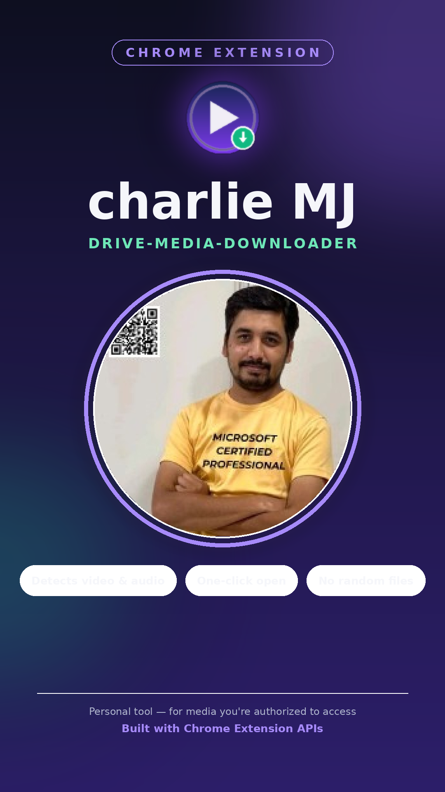
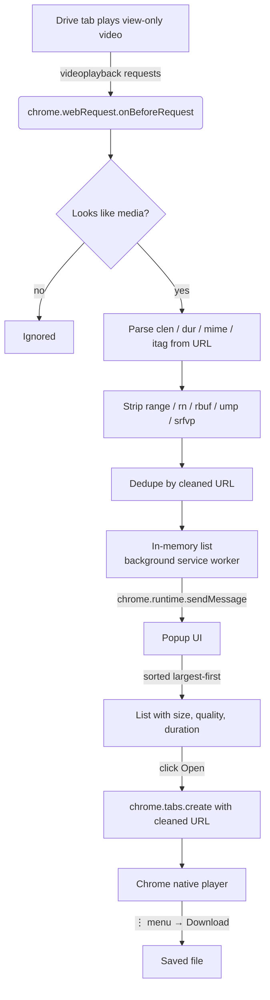

# charlie MJ — drive-media-downloader



A Chrome extension that automates the manual DevTools workflow for saving
Google Drive "view-only" videos and audio you are already authorized to
access — turning a ~30-step manual process into a couple of clicks.


---

## Table of contents

- [Why I built this](#why-i-built-this)
- [What it does](#what-it-does)
- [Features](#features)
- [How it works](#how-it-works)
- [Architecture](#architecture)
- [Tech stack](#tech-stack)
- [Project structure](#project-structure)
- [Installation](#installation)
- [Usage](#usage)
- [Permissions explained](#permissions-explained)
- [Scope, ethics, and limitations](#scope-ethics-and-limitations)
- [Roadmap](#roadmap)
- [License](#license)

---

## Why I built this

Google Drive's "view-only" video player streams video and audio as
separate byte-range-limited network requests (`videoplayback` calls), and
the only reliable way to grab a usable link is:

1. Open DevTools → Network tab.
2. Filter requests by `mime=video` / `mime=audio`.
3. Play the video so the requests fire.
4. Copy the right request URL.
5. Manually delete the trailing `range=…&rn=…&rbuf=…&ump=…&srfvp=…`
   parameters so the link points at the *whole* file instead of one small
   chunk.
6. Paste the cleaned URL into a new tab.
7. Use the native player's **⋮** menu to download it.
8. Repeat steps 2–7 separately for audio.

Doing that by hand for every video, every time, is slow and repetitive.
This extension automates steps 2–6 so all that's left is clicking **Open**
and then downloading from the native player — the same manual technique,
just no longer manual.

## What it does

You paste nothing into this extension. Instead, while you have a Drive
video open and playing in a tab, the extension passively watches network
traffic for `videoplayback` requests, and its popup shows you a live list
of every video/audio stream it has seen — each one already cleaned up and
ready to open.

## Features

- **Automatic detection** — no copy/pasting URLs out of DevTools.
- **Real file sizes, not guesses** — reads the `clen` (content length)
  query parameter Google embeds directly in the URL, rather than trying to
  infer size from network response headers (which are unreliable on
  chunked requests).
- **Automatic byte-range stripping** — removes the chunk-only parameters
  (`range`, `rn`, `rbuf`, `ump`, `srfvp`) that aren't part of Google's
  signed parameter list, so every link points at the complete file instead
  of a small fragment.
- **Sorted by size, largest first** — the biggest entry is normally the
  full-quality stream, so it's immediately visible.
- **Quality labels** — recognizes common `itag` values (e.g. `137` →
  "1080p video", `140` → "128kbps audio") so entries are human-readable.
- **Automatic deduplication** — every byte-range chunk of the same stream
  collapses into one entry once the chunk-only parameters are stripped.
- **One-click open, native download** — opens the cleaned link directly in
  a new tab so Chrome's own player and its **⋮** → Download control
  handle the actual file save. The extension never silently downloads a
  random/unnamed file on your behalf.
- **Nothing leaves your browser** — the detected list lives in the
  background service worker's memory for the current session only. There
  is no server, no analytics, no external network call.

## How it works

### 1. Detecting requests

`background.js` registers a `chrome.webRequest.onBeforeRequest` listener
for all URLs. It filters for anything that looks like a media request
(`videoplayback`, common audio/video file extensions, or `mime=video` /
`mime=audio` query hints).

### 2. Reading metadata straight from the URL

Google's `videoplayback` URLs already carry their own metadata as query
parameters:

| Param   | Meaning                          |
|---------|-----------------------------------|
| `clen`  | Full file size, in bytes          |
| `dur`   | Duration, in seconds              |
| `mime`  | e.g. `video/mp4`, `audio/mp4`     |
| `itag`  | A format/quality identifier       |

Reading these directly is far more reliable than trying to capture
`Content-Length` from network response headers, which — on a chunked
`206 Partial Content` response — often reflects only the size of that one
chunk, not the full file.

### 3. Stripping the byte-range

The URL also carries request-specific parameters that restrict the
response to one small byte range: `range`, `rn`, `rbuf`, `ump`, `srfvp`.
Cross-referencing Google's own `sparams`/`lsparams` fields (which list
exactly which parameters are covered by the request's cryptographic
signature) confirms none of those five are signed — so removing them
doesn't invalidate the request, it just changes it from "give me bytes
X–Y" to "give me the whole file".

The removal is done as a **literal substring edit** on the original URL
string — not by rebuilding the URL through `URLSearchParams` — because
reserializing would re-percent-encode characters inside the `sig`/`lsig`
values (colons, commas, `=`) and risk producing bytes the signature check
doesn't expect. This mirrors exactly what you'd do by hand in a text
editor.

### 4. Deduplication

Because every byte-range chunk of the same stream produces an identical
cleaned URL once those five parameters are gone, the extension naturally
collapses repeat chunk requests into a single entry — no separate
grouping logic needed.

### 5. Opening the link

Clicking **Open** calls `chrome.tabs.create()` with the cleaned URL. A
normal navigation to a full (non-range) `videoplayback` URL is rendered by
Chrome as a native, playable page — with a download control in its own
**⋮** menu — instead of triggering a forced file download the way a
partial-range request does.

## Architecture



## Tech stack

| Layer               | Technology                                             |
|---------------------|---------------------------------------------------------|
| Extension platform  | Chrome Extension **Manifest V3**                        |
| Request interception| `chrome.webRequest` API                                  |
| Tab control         | `chrome.tabs` API                                        |
| Background logic    | Vanilla JavaScript, running as a Manifest V3 **service worker** (no build step, no bundler, no dependencies) |
| Popup UI            | Plain HTML, CSS, and JavaScript                          |
| Icon design         | Generated PNG assets (16/32/48/128 px)                   |

No frameworks, no npm dependencies, and no external requests are used by
the extension itself — everything runs from static files Chrome loads
directly.

> The repo also contains a `frontend/` scaffold (React + Vite) intended
> for a future companion web UI. It isn't required to use the extension
> and isn't wired up to it yet — see [Roadmap](#roadmap).

## Project structure

```text
charlie-MJ-drive-media-downloader/
├── extension/                 → the actual Chrome extension (this is what you load)
│   ├── manifest.json          → Manifest V3 config, permissions, icons
│   ├── background.js          → detects, parses, cleans, and dedupes media requests
│   ├── content.js             → placeholder for future in-page UI (currently unused)
│   ├── icons/                 → toolbar / store icons (16, 32, 48, 128 px)
│   └── popup/
│       ├── popup.html         → popup markup
│       ├── popup.css          → popup styling
│       └── popup.js           → renders the list, wires up Open/Clear buttons
├── frontend/                  → optional React + Vite scaffold for a future web UI
├── README.md                  → this file
├── LICENSE
└── .gitignore
```

## Installation

### Requirements

Google Chrome or any Chromium-based browser that supports Manifest V3 extensions.

### Steps

1. **Download or clone** this repository.
2. **Extract the repository** to a location on your computer, such as `C:\`.
3. Open Google Chrome and go to `chrome://extensions`.
4. Enable **Developer mode** using the toggle in the top-right corner.
5. Click **Load unpacked**.
6. Select the **`extension/`** folder inside the downloaded repository.

   > **Important:** Select the `extension/` folder, **not the repository root folder**.
7. Once loaded, optionally **pin the extension** to the Chrome toolbar for easy access.


## Usage

1. Open the Google Drive video you're authorized to view.
2. Press play — this triggers the `videoplayback` network requests the
   extension listens for.
3. Click the extension icon.
4. You'll see a list of detected video/audio streams, largest first, each
   labeled with size, quality, and duration where available.
5. Click **Open** on the one you want.
6. In the new tab, use the native player's **⋮** menu (or right-click →
   **Save as**) to download it.
7. Repeat for the matching audio stream if you want to merge it with the
   video afterward (e.g. with `ffmpeg`).

## Permissions explained

| Permission          | Why it's needed                                                   |
|---------------------|--------------------------------------------------------------------|
| `webRequest`        | To observe outgoing media requests so they can be listed in the popup. The extension only *reads* request metadata — it never modifies, blocks, or redirects traffic. |
| `tabs`              | To open the cleaned link in a new tab when you click **Open**.     |
| `host_permissions: <all_urls>` | Required by `webRequest` to see requests on any site you're viewing media on (not limited to `drive.google.com`, in case Google serves from a different domain in your region). |

The extension does **not** request `downloads` — it deliberately never
saves files on your behalf. It also doesn't request `storage`, since
detected media lists are kept only in memory and are cleared when the
browser closes or you click **Clear list**.

## Scope, ethics, and limitations

- This tool only works with **media requests your own authorized browser
  session already made**. It doesn't bypass Google account permissions,
  authentication, or any owner-set restriction — every link it surfaces
  is one your browser could already see and load.
- It's meant for saving your own files, or files you have explicit
  permission to download, for personal backup/offline use.
- Drive's signed URLs **expire** (see the `expire` parameter) and are
  tied to your session — a link that works now may 403 later, and won't
  work if copied to a different browser/account.
- `itag` → quality label mapping is a small, hand-maintained lookup table
  of commonly seen values; an unrecognized `itag` just won't show a
  friendly label (it still works, just without the badge).
- Google can change the structure of these URLs at any time, which could
  break detection or the range-stripping logic without notice.

## Roadmap

Ideas for future versions (not yet implemented):

- A download queue for handling multiple videos in one session.
- Automatic video + audio merging via `ffmpeg.wasm` in the browser, or a
  small local helper app.
- Wiring up the `frontend/` React UI as an optional richer interface on
  top of the same background detection logic.
- Progress indicators and retry handling for large files.

## License

MIT — see [`LICENSE`](LICENSE).

## Repository

[GitHub Repository](https://github.com/awsrmmustansarjavaid/charlie-MJ-drive-media-downloader)

